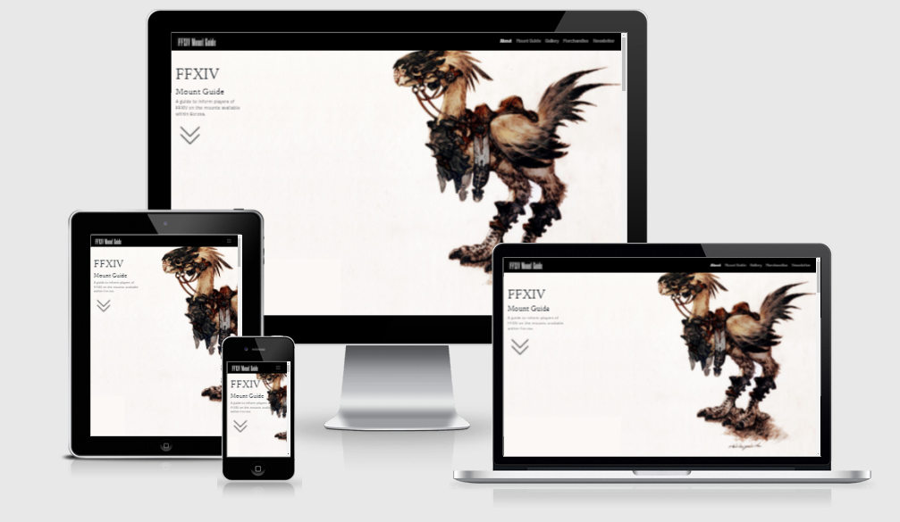
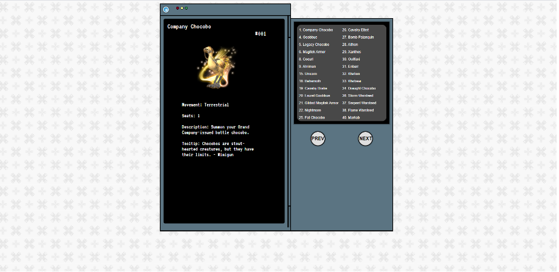
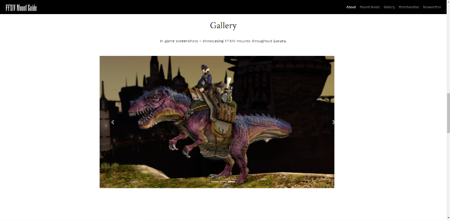
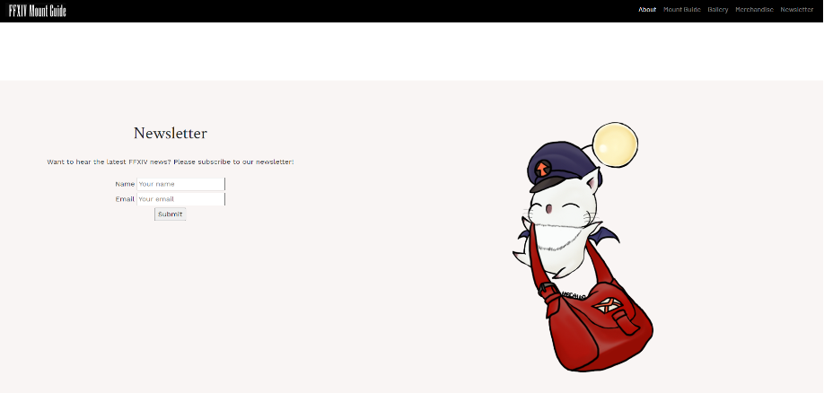
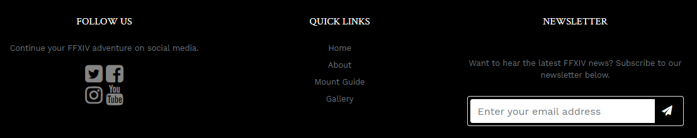
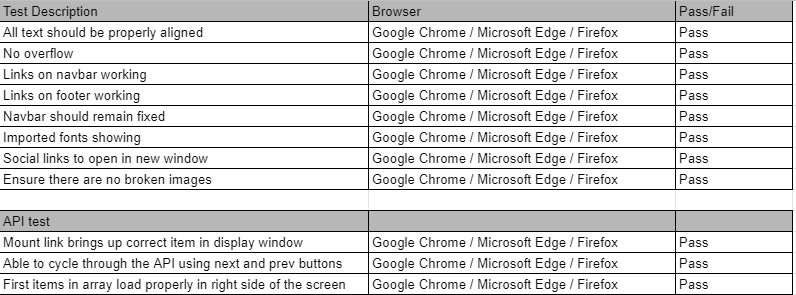
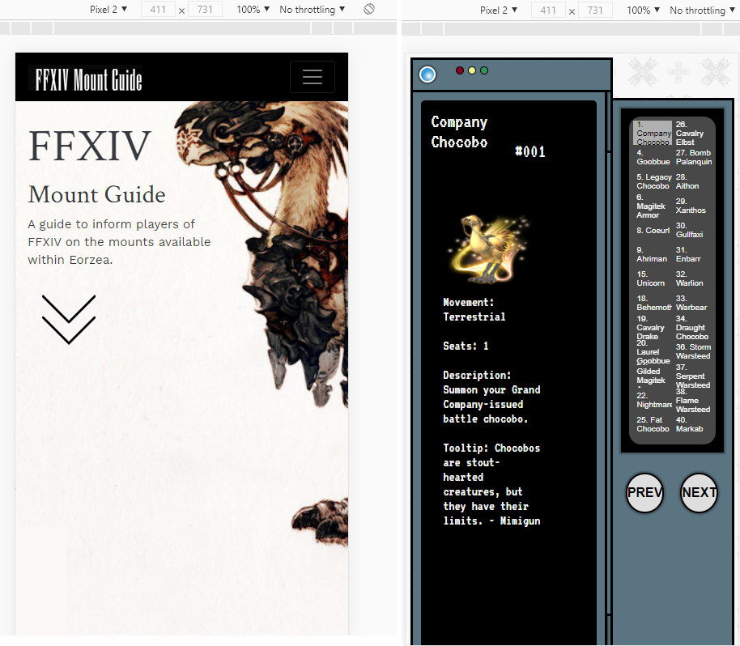
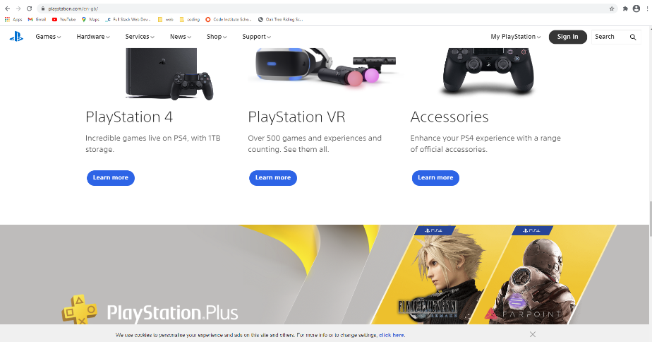
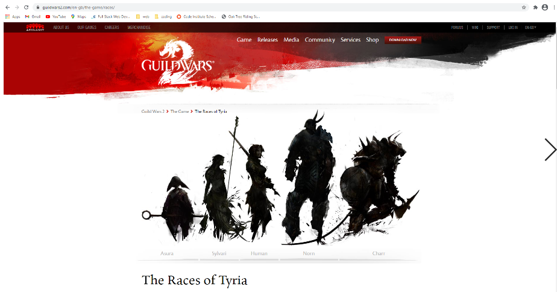

# FFXIV Mount Guide

FFXIV is one of the most popular video games to date within the MMORPG genre. The purpose of the website is to provide information of mounts within the game to both
new and existing players, similar to a Pokedex in popular RPG Pokemon. The website will build upon existing skills within HTML and CSS and utilize new skills within Javascript, 
and the use of an API. 

Please [click here](https://rebeccadev.github.io/ms2-ffxiv-mount-guide/) to view the website.

### Index

- [Ux](#ux)
- [Features](#features)
- [Resources](#resources)
- [Testing](#testing)
- [Problems and solutions](#problems-and-solutions)
- [Deployment](#deployment)
- [Credits](#credits)
- [Acknowledgements](#acknowledgements)

## UX
 
### Aims

**Site owner's goal**

To act as a promotional tool, increasing brand awareness for new and existing players of FFXIV. 

**External user’s goal** 

The site's users are prospective new and existing players, looking to find more information on Mounts within the game. 

 
#### User Stories
> -  *I want to learn more about the mounts within FFXIV*.
> -  *I would like to see a gallery showcasing the Mounts in game*.
> -  *I would like to keep up to date with news on FFXIV.*
> -  *I would like to engage with other fans of FFXIV*.

### Skeleton

#### Wireframes

Wireframes have been created using a mobile first approach. 
Please [click here](assets/ms2wireframes.pdf) to view the PDF showing full wireframes for the site. 

### Surface
I have taken on inspiration from gaming websites such as the Playstation website and website for popular mmo Guild Wars 2. 
I liked how clean the websites look, and how they utilize different coloured backgrounds for different sections. 

**Colours**

White space has been used to provide a sense of calm,

I have used (#ffffff) for my main text to make the typography contrasting and clear to the user against the white and cream background. 
and have used (#000000) for my text within the footer section to stand out against the black background. 

**Typography**

**Heading text**

The font Crimson Text has been used for headings - this font works well against the sans serif body text and provides an old school fantasy feel. 

**Body text**

Work sans has been used for the body text, this sans serif font is clearly legible to the user and contrasts nicely against the heading font.

**Mount Guide text**
Within the Mount Guide I have used the font VT323 - I used this font as it is reminiscent of old 8-bit style video games and thought
it fitted well within the mount guide. 

**Imagery**

I have used images from the Final Fantasy franchise within the website. Alot of the images have been obtained from the website
clean PNG. I wanted to use illustrated images to fit in with the fantasy theme. 

For the gallery I have used screenshots from the video game itself, so users can see what these mounts look like whilst in game.

---
## Features

### Current features

- **Intro/Homepage:** contains hero image to create impact, contains initial information about the mount guide website.
- **About:** provide information on the content of the website - explaining about the mounts within FFXIV.
- **Mount Guide** mount guide section which links to the mount guide in seperate window
- **Gallery** which showcases different mounts within the game.
- **Merchandise** provides information on outlets where merchandise can be bought for the game
- **Footer:** with social media links to enable easy access to other social media sites which can offer more information to the user.

### Features to be added

These are features that lie out of the current scope, but could be added when knowledge of development increases.

- User generated gallery - players can interact by uploading their own screenshots.

- Blog - A blog with updates on FFXIV, enabling visitors to the websites to leave comments and interact. 

## Technologies 

The following technologies have been used in the project.

**Languages**

- HTML 

- CSS

- Javascript

**API**

[FFXIV collect](https://github.com/mattantonelli/ffxiv-collect/wiki) A RESTful JSON API 

**Frameworks**

- [Bootstrap](https://getbootstrap.com/) -  Free and open-source CSS framework directed at responsive, mobile-first front-end web development

**Integrations**
- [Font Awesome](https://fontawesome.com/) - used for icons within the footer bar. 

- [Google fonts](https://fonts.google.com/) - A library of 1005 free licensed font families. 

**IDE, Version control, Repository storage**

[Git](https://git-scm.com/) - Distributed Version Control tool to store versions of files and track changes.

[GitPod](https://gitpod.io/) - Workspace IDE.

[GitHub](https://github.com/) - Hosting service used to manage my Git repositories.

## Resources

The following resources have been used within the project.

* [Adobe Photoshop](https://www.adobe.com/uk/products/photoshop.html) for editing image sizes and for using the color picker.

* [w3schools.com](https://www.w3schools.com/) - resource to improve general knowledge of HTML and CSS and Javascript

* [Balsamiq](https://balsamiq.com/) - used for the creation of wireframes during UI design stage. 

* [Stack Overflow](https://stackoverflow.com/) - general resource used for technical queries.

* [Chrome DevTools](https://developers.google.com/web/tools/chrome-devtools) - used to debug HTML and CSS and to view responsiveness on different screen sizes.

* [Youtube](https://www.youtube.com/) - used a general resource to improve knowledge of javascript

* [Build a Pokedex with Vanilla HTML, CSS, and JavaScript](https://www.youtube.com/watch?v=T-VQUKeSU1w) - tutorial by James Q Quick

## Testing

#### Testing user Stories

*I want to learn more about the mounts within FFXIV*.

 - The main way the user can learn more about the mounts within the game is to use the mount guide. 
This connects to an API FFXIV Collect where users can obtain information on mounts within FFXIV.

*I would like to see a gallery showcasing the Mounts in game*.

-The gallery contains screenshots, which bring the descriptions of the mounts to life.

*I would like to keep up to date with news on FFXIV.*

There is a newsletter section on the site aswell as a newsletter section within the footer section.

*I would like to engage with other fans of FFXIV*.

Social Media Links are clearly displayed within the footer, enabling fans to engage on different social media platforms. 

#### Testing tools 

[W3C Markup Validation Service](https://validator.w3.org/) was used to test HTML
- 2 x errors were found where image tags didn't have alt attributes. These were fixed and the index.html was then free of errors.

[Jigsaw Validation Service](https://jigsaw.w3.org/css-validator/) was used to test CSS. This was found to be free of errors. 

[JS Hint](https://jshint.com/) was used to test JS for errors. 
- 2 x errors where semi colons needed to be added.
- 7 x errors relating to dot notation, e.g	'image' is better written in dot notation.

#### Manual testing log

A manual testing log was carried out on Google Chrome, Microsoft Edge and Firefox. The results are displayed below.

#### Responsiveness

Google Chrome developer tools was used to test the responsiveness. I used media queries to ensure the website scaled down to mobile correctly.
I also manually tested this on a Google Pixel 3a mobile device.

## Problems and solutions

#### Design

- I initially chose a different image for my hero image, however when scaling down to mobile I couldn't find a font colour which stood out against the background enough
to make it a viable design with good usability. I opted for a different hero image which contained alot of whitespace which helped me overcome this problem. 

#### Overflow

- There was overflow when viewing the website both on PC and in mobile form. I found the problem to be from the jumbotron text which had an offset property. Removing
the offset property solved this problem. 

#### App design 

- I had originally intended to have the mount guide app appear in the index.html, however because the app uses CSS flexbox this CSS was contrasting with the Bootstrap framework.
To solve this problem I initally tried to place the app into an iframe, this however did not work well. The next solution was to make the app appear within a pop up window
so it would display properly. 

## Deployment 

The website was deployed to Github pages via the following steps.

1. Log in to Github and locate the websites repository.
2. Under the repository name click on settings on the top right of the menu.
3. Under the source section select the dropdown 'None' and Master branch.
4. The page will automatically refresh.
5. Scroll back down through the page to locate the now published site link in the "GitHub Pages" section.

### Forking the repository
Forking enables the user to make a copy of the original repository. To carry this out the following steps need to be taken.

1. Log in to GitHub and locate the websites repository.
2. At the top right of the Repository click the Fork Button.
3. There should now be a copy of the repository on github.

### Cloning the repository
To clone the repository the following steps need to be taken. 

1. On GitHub, navigate to the main page of the repository. 
2. Click the green Clone or download Button under the repository name. 
3. Open Git Bash.
4.Change the current working directory to the location where you want the cloned directory.
5.Type git clone, and then paste the URL you copied earlier.
6.Press Enter to create the local clone.

## Credits

### Code 

- [Build a Pokédex REPLICA with Vanilla JavaScript and the PokéAPI Justin Kim](https://www.youtube.com/watch?v=wXjSaZb67n8) This tutorial
has helped me with building my app and understanding the use of APIS. I have edited the CSS of the pokedex for my design. In terms
of code I have used the tutorial to produce fetch requests and manipulate the dom. It has been such a valuable resource. The tutorial
uses the Poke API, however since I have used the FFXIV collect API I have had to make my own paging system within javascript. 

- [Bootstrap 4: Carousel / Slider / Slideshow Edgar Lynx](https://codepen.io/edgarlnx/pen/MBjrMK) Codepen Snippet used for Gallery

Inspiration has been taken from the following websites

- [Playstation](https://www.playstation.com/)

I really liked the use of multiple background colours for sections within the playstation website. I feel this
helps to organise different content well. 

- [Guild Wars 2](https://welcome.guildwars2.com/) 

I really liked the use of whitespace within the Guild Wars 2 website. I also liked the contrast between the header
and body text. 

**Imagery**
* [Clean PNG](https://www.cleanpng.com/) royalty free stock images for illustrations used within the website.

* [Wallpaper Cave](https://wallpapercave.com/final-fantasy-chocobo-wallpaper) used for the Hero image. 

* [Final Fantasy Fandom](https://finalfantasy.fandom.com/wiki/Mount) used for gallery images. 

* [Final Fantasy Fandom](https://finalfantasy.fandom.com/wiki/Mount) used for gallery images. 

* [Am I responsive](http://ami.responsivedesign.is/) responsive image generator used for Readme

## Acknowledgements

- My mentor Aaron Sinnott for their helpful feedback. 

- The Code institute slack community

- Tutor support for help with technical queries. 